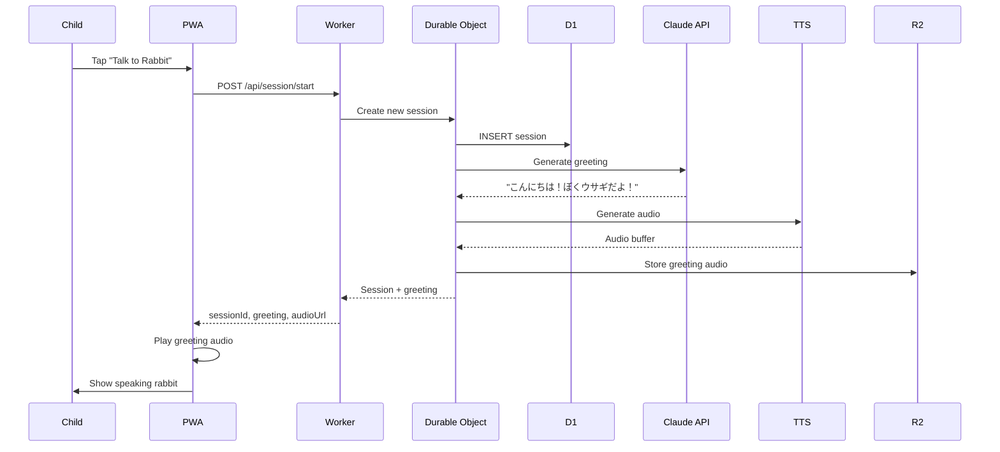
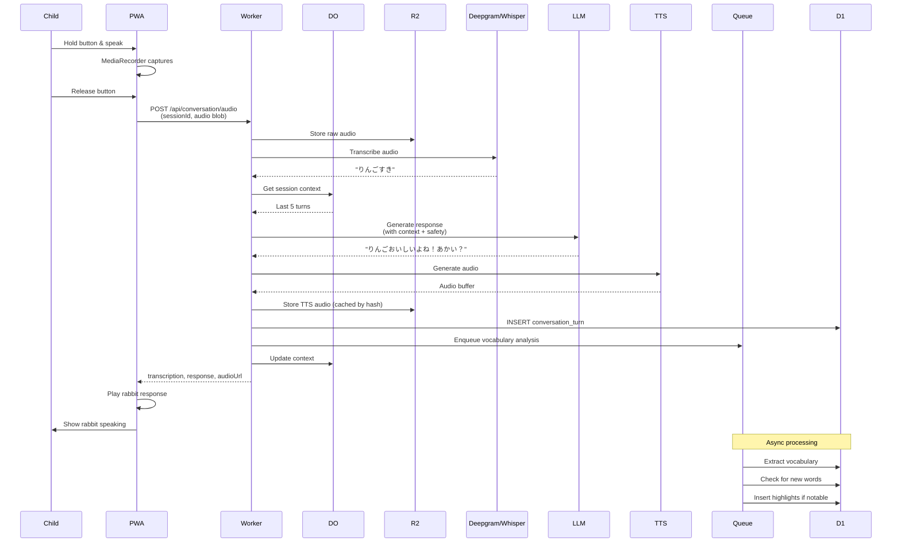
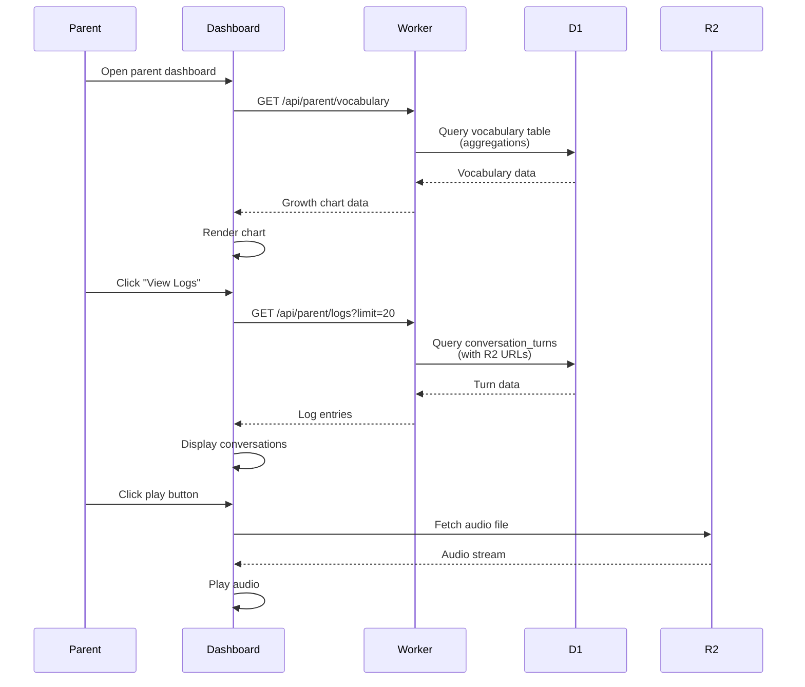

# Conversation Flow - my-usagi

## Overview
Describes the end-to-end flow of a child's conversation with the rabbit pet.

## User Flows

### 1. Initial Session Start



### 2. Child Speaks to Rabbit



### 3. Parent Views Dashboard



## State Transitions

### Session States

```
START → ACTIVE → INACTIVE
         ↓
      (alarm timeout)
         ↓
       CLOSED
```

- **START**: Session created, greeting sent
- **ACTIVE**: Child actively conversing (< 5 min since last turn)
- **INACTIVE**: No activity for 5 minutes, but session still in memory
- **CLOSED**: Session expired (30 minutes), removed from DO, data in D1

## LLM Prompt Strategy

### System Prompt (Rabbit Persona)

```
あなたは3歳の子どものペットのウサギです。
名前は「ウサギくん」です。

あなたの性格:
- とても優しい
- 好奇心旺盛
- 子どもの言うことに興味津々
- 簡単な日本語を使う（ひらがな中心）

会話のルール:
1. 短い文章で話す（15文字以内）
2. 質問を含める（子どもの会話を促す）
3. 子どもの言葉を繰り返して共感する
4. 不適切な内容には応答しない
5. 子どもを褒める

例:
- 子ども「きょうはれた」→ ウサギ「はれてうれしいね！なにしてあそぶ?」
- 子ども「ママいない」→ ウサギ「ママすぐかえってくるよ。いっしょにあそぼう！」
```

### Context Window Management

Keep only last 5 turns in DO memory:
```javascript
{
  context: [
    { role: "user", content: "りんごすき" },
    { role: "assistant", content: "りんごおいしいね！" },
    { role: "user", content: "あかいりんご" },
    { role: "assistant", content: "あかいのすき？" },
    { role: "user", content: "うん！" }
    // 5 turns max, FIFO queue
  ]
}
```

## Safety Mechanisms

### 1. Input Validation
- Check audio duration (min: 0.5s, max: 30s)
- Validate session IDs (UUID format)
- Rate limiting per session

### 2. Prompt Injection Protection
```javascript
function sanitizeInput(text) {
  // Remove system-level instructions
  const dangerous = [
    /ignore (previous|all) instructions/i,
    /you are now/i,
    /new role:/i,
    /system:/i
  ];

  for (const pattern of dangerous) {
    if (pattern.test(text)) {
      return "[filtered]";
    }
  }

  return text.slice(0, 200); // Max length
}
```

### 3. Output Filtering
```javascript
function validateResponse(response) {
  // Check response safety
  const inappropriate = [
    /暴力/,
    /危険/,
    // ... add more patterns
  ];

  for (const pattern of inappropriate) {
    if (pattern.test(response)) {
      return "ごめんね、よくわからなかった！";
    }
  }

  return response;
}
```

### 4. Monitoring
- Log all conversations to D1
- Flag unusual patterns for review
- Parent dashboard access to all logs

## Error Handling

### Audio Processing Failures
1. ASR fails → "もういちどいってくれる?"
2. TTS fails → Return text response only, log error
3. LLM timeout → Fallback response: "ちょっとまってね！"

### Network Issues
1. PWA uses Service Worker for offline detection
2. Queue requests in IndexedDB when offline
3. Retry on reconnection

### Session Issues
1. Expired session → Redirect to start new session
2. Invalid session ID → 404 error with friendly message

## Performance Targets

- **Session start**: < 2s (greeting audio ready)
- **Audio roundtrip**: < 3s (speak → response audio)
  - ASR: < 1s
  - LLM: < 1s
  - TTS: < 1s
- **Dashboard load**: < 1s (initial data)

## Child UX Principles

1. **Always give feedback**
   - Show visual indicator when listening
   - Animate rabbit while processing
   - Never leave child waiting without indication

2. **Keep it simple**
   - One large button: "Push to talk"
   - Automatic audio playback
   - No complex navigation

3. **Make it fun**
   - Rabbit animations (idle, listening, speaking)
   - Sound effects for interactions
   - Colorful, large UI elements

4. **Safety first**
   - No external links in child interface
   - No data collection without parent consent
   - All conversations logged for parent review
