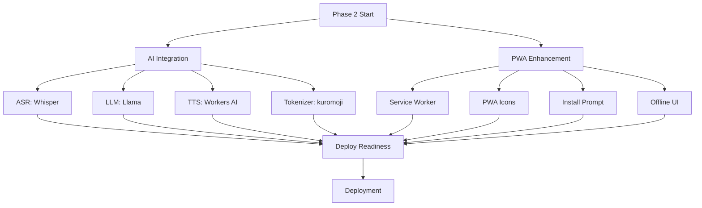

# Phase 2 Implementation Plan - my-usagi

**Date:** 2026-02-01
**Status:** 🎯 Planning Complete
**Dependencies:** Phase 1 Complete ✅

---

## Overview

Phase 2 integrates real AI services and enhances PWA capabilities to transform the MVP into a production-ready application. This phase focuses on:

1. **AI Integration** - Replace mocked services with Cloudflare Workers AI
2. **PWA Enhancement** - Add offline support and installability
3. **Deployment Readiness** - Verification and documentation

---

## Priority 1: AI Integration

### 1.1 ASR (Automatic Speech Recognition)

**Target:** Replace `mockASR` in `src/index.ts:~200-210`

**Implementation:**
- Service: `@cf/openai/whisper` (Cloudflare Workers AI)
- Input: WebM/Opus audio from MediaRecorder
- Output: Japanese transcription text
- Error handling: Fallback to text input on failure

**Code Location:** `POST /api/conversation/audio` handler

**Changes Required:**
```typescript
// Current (line ~200):
const transcription = await mockASR(audioFile);

// After:
const transcription = await runWhisperASR(env, audioFile, "ja");

// New function to add:
async function runWhisperASR(env: Env, audioBlob: ArrayBuffer, language: string): Promise<string> {
  const response = await env.AI.run("@cf/openai/whisper", {
    audio: Array.from(new Uint8Array(audioBlob)),
    language: language,
  });
  return response.text;
}
```

**Testing:**
- Verify with Japanese audio samples
- Test with different audio qualities
- Confirm error handling

---

### 1.2 LLM (Language Model)

**Target:** Replace `mockLLM` in `src/index.ts` (ConversationSession Durable Object)

**Implementation:**
- Service: `@cf/meta/llama-3.1-8b-instruct` (Cloudflare Workers AI)
- System prompt: Child-safe, 3-year-old appropriate responses
- Language: Japanese
- Context: Last 5 conversation turns (already in state)

**Code Location:** ConversationSession class, `/chat` endpoint (~line 450)

**System Prompt Design:**
```typescript
const RABBIT_SYSTEM_PROMPT = `あなたは3歳の子供と話す優しいウサギのペットです。

ルール:
1. 常に優しく、肯定的に応答する
2. 年齢に適した言葉を使う（ひらがな・カタカナ中心）
3. 危険な内容、不適切な内容は絶対に言わない
4. 子供の言葉を褒めて、語彙を増やす手助けをする
5. 短い文章で話す（1-2文）
6. 教育的で創造的な会話を促す

あなたは「うさちゃん」です。子供の最高の友達になってください。`;
```

**Changes Required:**
```typescript
// Current (line ~450):
const response = await mockLLM(userMessage, context);

// After:
const response = await runLlamaLLM(env, userMessage, context);

// New function:
async function runLlamaLLM(env: Env, userMessage: string, context: Turn[]): Promise<string> {
  const messages = [
    { role: "system", content: RABBIT_SYSTEM_PROMPT },
    ...context.map(t => [
      { role: "user", content: t.childInput },
      { role: "assistant", content: t.rabbitResponse }
    ]).flat(),
    { role: "user", content: userMessage }
  ];

  const response = await env.AI.run("@cf/meta/llama-3.1-8b-instruct", {
    messages,
    max_tokens: 100,
    temperature: 0.7,
  });

  return response.response;
}
```

**Safety Considerations:**
- Input sanitization (already in place via content filtering)
- Response validation (check for inappropriate content)
- Logging for parental review

**Testing:**
- Test with various child inputs
- Verify age-appropriate responses
- Test context awareness (multi-turn conversations)

---

### 1.3 TTS (Text-to-Speech)

**Target:** Replace `mockTTS` in `src/index.ts`

**Implementation Options:**

**Option A: Cloudflare Workers AI** (if available)
- Service: Check `@cf/deepgram/whisper-tts` or similar
- Pros: Integrated, no external API
- Cons: May not support Japanese

**Option B: External Service**
- Google Cloud TTS (Japanese voices available)
- ElevenLabs (high quality, expensive)
- Azure Cognitive Services (good Japanese support)

**Recommended: Start with Option A, fallback to Option B if needed**

**Code Location:** ConversationSession class, `/init` and `/chat` endpoints

**Changes Required:**
```typescript
// Current (line ~420, ~480):
const ttsUrl = await mockTTS(text);

// After:
const ttsUrl = await generateTTS(env, text, sessionId, turnId);

// New function:
async function generateTTS(env: Env, text: string, sessionId: string, turnId: string): Promise<string> {
  // Try Workers AI first
  try {
    const audioData = await env.AI.run("@cf/microsoft/speecht5-tts", {
      text,
      language: "ja-JP",
    });

    // Upload to R2
    const key = `tts/${sessionId}/${turnId}.mp3`;
    await env.R2.put(key, audioData, {
      httpMetadata: { contentType: "audio/mpeg" },
    });

    return `https://audio.my-usagi.example.com/${key}`; // Signed URL
  } catch (e) {
    // Fallback to external service or mock
    console.error("TTS failed:", e);
    throw new Error("TTS generation failed");
  }
}
```

**R2 Signed URLs:**
- Implement URL signing for security
- Set expiration (e.g., 24 hours)
- Consider caching by content hash

**Testing:**
- Test Japanese pronunciation quality
- Verify audio format compatibility
- Test R2 upload and URL generation

---

### 1.4 Japanese Tokenization (kuromoji-wasm)

**Target:** Replace `tokenizeJaLoose` in queue consumer (~line 350)

**Implementation:**
- Package: `kuromoji-wasm` or `kuromoji.js`
- Use: Accurate Japanese morphological analysis
- Output: Word boundaries for vocabulary tracking

**Code Location:** Queue consumer, `queue()` function

**Changes Required:**
```typescript
// Install: npm install kuromoji-wasm

import * as kuromoji from "kuromoji-wasm";

// Current (line ~350):
const words = tokenizeJaLoose(transcription);

// After:
const words = await tokenizeJaKuromoji(transcription);

// New function:
async function tokenizeJaKuromoji(text: string): Promise<string[]> {
  const tokenizer = await kuromoji.builder({ dicPath: "/dict" }).build();
  const tokens = tokenizer.tokenize(text);

  // Filter to content words (nouns, verbs, adjectives)
  return tokens
    .filter(t => ["名詞", "動詞", "形容詞"].includes(t.pos))
    .map(t => t.surface_form);
}
```

**Dictionary Setup:**
- Bundle kuromoji dictionary in Workers
- Consider using D1 for dictionary caching
- Test performance impact on queue consumer

**Testing:**
- Compare accuracy vs. naive tokenization
- Verify vocabulary extraction quality
- Test with various sentence structures

---

## Priority 2: PWA Enhancement

### 2.1 Service Worker Caching Strategy

**Target:** Implement offline functionality in `public/sw.js`

**Implementation:**

**Cache Strategy:**
1. **Static Assets** (Cache First)
   - HTML, CSS, JS files
   - Manifest, icons
   - TTL: 7 days

2. **TTS Audio** (Cache First, Network Fallback)
   - Cache for offline playback
   - TTL: 30 days

3. **API Calls** (Network First, Cache Fallback)
   - Session data, conversation logs
   - Offline queue for audio uploads

**Code Location:** `public/sw.js`

**Implementation:**
```javascript
const CACHE_NAME = "my-usagi-v1";
const STATIC_ASSETS = [
  "/",
  "/index.html",
  "/app.js",
  "/style.css",
  "/manifest.webmanifest",
];

self.addEventListener("install", (event) => {
  event.waitUntil(
    caches.open(CACHE_NAME).then((cache) => {
      return cache.addAll(STATIC_ASSETS);
    })
  );
});

self.addEventListener("fetch", (event) => {
  const url = new URL(event.request.url);

  // Static assets: Cache First
  if (STATIC_ASSETS.includes(url.pathname)) {
    event.respondWith(
      caches.match(event.request).then((response) => {
        return response || fetch(event.request);
      })
    );
    return;
  }

  // TTS audio: Cache First
  if (url.pathname.startsWith("/tts/")) {
    event.respondWith(
      caches.open(CACHE_NAME).then((cache) => {
        return cache.match(event.request).then((response) => {
          return response || fetch(event.request).then((netResponse) => {
            cache.put(event.request, netResponse.clone());
            return netResponse;
          });
        });
      })
    );
    return;
  }

  // API calls: Network First
  if (url.pathname.startsWith("/api/")) {
    event.respondWith(
      fetch(event.request)
        .catch(() => caches.match(event.request))
    );
    return;
  }

  // Default: Network First
  event.respondWith(fetch(event.request));
});
```

**Offline Queue:**
- Store audio uploads in IndexedDB when offline
- Retry when online (Background Sync API)

**Testing:**
- Test with DevTools offline mode
- Verify static asset caching
- Test TTS audio playback offline
- Test API fallback behavior

---

### 2.2 PWA Icons

**Target:** Generate icon set for installability

**Requirements:**
- 192x192 (standard)
- 512x512 (high-res)
- Maskable icon (safe area)

**Implementation:**

**Design Guidelines:**
- Simple, recognizable rabbit character
- High contrast for visibility
- Works on various backgrounds

**Tool Options:**
- PWA Asset Generator (npm package)
- Figma + export
- Online icon generator

**Files to Create:**
- `public/icons/icon-192.png`
- `public/icons/icon-512.png`
- `public/icons/icon-maskable.png`

**Update `public/manifest.webmanifest`:**
```json
{
  "icons": [
    {
      "src": "/icons/icon-192.png",
      "sizes": "192x192",
      "type": "image/png"
    },
    {
      "src": "/icons/icon-512.png",
      "sizes": "512x512",
      "type": "image/png"
    },
    {
      "src": "/icons/icon-maskable.png",
      "sizes": "512x512",
      "type": "image/png",
      "purpose": "maskable"
    }
  ]
}
```

**Testing:**
- Test installability on Chrome, Safari
- Verify icon display on home screen
- Test maskable icon with different safe areas

---

### 2.3 Install Prompt

**Target:** Add A2HS (Add to Home Screen) prompt

**Implementation:**

**Code Location:** `public/app.js`

**Add Install Button:**
```javascript
let deferredPrompt;

window.addEventListener("beforeinstallprompt", (e) => {
  e.preventDefault();
  deferredPrompt = e;

  // Show install button
  const installBtn = document.createElement("button");
  installBtn.textContent = "アプリをインストール 📱";
  installBtn.className = "install-btn";
  installBtn.addEventListener("click", async () => {
    if (deferredPrompt) {
      deferredPrompt.prompt();
      const { outcome } = await deferredPrompt.userChoice;
      console.log("Install outcome:", outcome);
      deferredPrompt = null;
      installBtn.remove();
    }
  });

  document.body.appendChild(installBtn);
});
```

**Styling:**
- Non-intrusive placement (bottom right)
- Dismissible
- Only show once per session

**Testing:**
- Test on Chrome Android
- Test on Safari iOS
- Verify prompt timing (not on first visit)

---

### 2.4 Offline UI Indicators

**Target:** Show network status to user

**Implementation:**

**Code Location:** `public/app.js`

**Network Status Indicator:**
```javascript
function updateNetworkStatus() {
  const isOnline = navigator.onLine;
  const indicator = document.getElementById("network-status");

  if (!isOnline) {
    indicator.textContent = "オフラインモード 📴";
    indicator.className = "offline";
  } else {
    indicator.textContent = "";
  }
}

window.addEventListener("online", updateNetworkStatus);
window.addEventListener("offline", updateNetworkStatus);
updateNetworkStatus();
```

**Add to `public/index.html`:**
```html
<div id="network-status" class="network-status"></div>
```

**Styling:**
- Top banner, yellow background
- Auto-hide when online
- Clear messaging

**Testing:**
- Toggle network in DevTools
- Verify indicator appears/disappears
- Test with slow 3G simulation

---

## Priority 3: Deployment Readiness

### 3.1 Configuration Updates

**Target:** Update `wrangler.jsonc` for Workers AI binding

**Changes Required:**
```jsonc
{
  // ... existing config ...

  // Add AI binding
  "ai": {
    "binding": "AI"
  },

  // Update environment variables (use wrangler secret put)
  // PARENT_PIN - already exists
  // ANTHROPIC_API_KEY - remove if using Workers AI only
}
```

**Env Interface Update (`src/index.ts`):**
```typescript
export interface Env {
  APP_ENV: string;
  LLM_PROVIDER: "workers-ai" | "anthropic"; // Update options

  ASSETS: Fetcher;
  DB: D1Database;
  R2: R2Bucket;
  ANALYSIS_QUEUE: Queue;
  CONVERSATION_SESSION: DurableObjectNamespace;
  AI: any; // Add Workers AI binding

  // Secrets
  PARENT_PIN?: string;
  ANTHROPIC_API_KEY?: string; // Keep for fallback
}
```

---

### 3.2 TypeScript Compilation

**Target:** Ensure all changes compile without errors

**Commands:**
```bash
npm install kuromoji-wasm
npm run typecheck
```

**Expected Output:** 0 errors

**Common Issues:**
- Workers AI types: Install `@cloudflare/workers-types`
- Kuromoji types: May need `@types/kuromoji` or type declarations
- Env binding types: Define proper types for `AI`

---

### 3.3 Local Testing

**Target:** Test with `wrangler dev`

**Commands:**
```bash
wrangler dev --local
```

**Test Cases:**
1. Session initialization
2. Audio upload and ASR
3. LLM response generation
4. TTS audio generation and playback
5. Vocabulary analysis queue
6. Parent dashboard queries
7. Service worker caching (use separate browser)

**Expected Behavior:**
- All API endpoints respond correctly
- Real ASR/LLM/TTS services work
- Queue consumer processes jobs
- Caching works offline

---

### 3.4 Deployment Guide

**Target:** Create comprehensive deployment documentation

**File:** `DEPLOY_GUIDE.md`

**Contents:**

1. **Prerequisites**
   - Cloudflare account with Workers AI access
   - wrangler CLI installed
   - D1 database created
   - R2 bucket created
   - Queue created

2. **Step-by-Step Instructions**
   - Apply D1 migrations
   - Set secrets
   - Update wrangler.jsonc with resource IDs
   - Deploy to production
   - Verify deployment

3. **Environment Variables**
   - PARENT_PIN
   - ANTHROPIC_API_KEY (optional fallback)

4. **Resource IDs Checklist**
   - D1 database_id
   - R2 bucket name
   - Queue name
   - Durable Object namespace

5. **Post-Deployment Verification**
   - Health check: `curl https://my-usagi.example.com/api/health`
   - Session test
   - Audio test
   - Parent dashboard test

6. **Rollback Procedure**
   - `wrangler rollback` command
   - Database backup restore

7. **Monitoring**
   - Workers Analytics
   - D1 metrics
   - R2 storage usage
   - Queue consumer errors

8. **Troubleshooting**
   - Common errors and solutions
   - Log analysis
   - Support resources

---

## Task Dependencies



**Parallel Work:**
- AI Integration and PWA Enhancement can be done concurrently
- Within AI Integration, ASR/LLM/TTS can be done in any order
- Within PWA Enhancement, all tasks can be done in any order

**Blockers:**
- Deployment depends on both AI Integration and PWA Enhancement
- TypeScript compilation must pass before deployment
- Local testing must pass before production deployment

---

## Acceptance Criteria

### AI Integration
- [ ] ASR transcribes Japanese audio accurately (>90% accuracy on clear speech)
- [ ] LLM generates age-appropriate responses in Japanese
- [ ] LLM maintains conversation context (5-turn memory)
- [ ] TTS generates clear Japanese audio
- [ ] Vocabulary extraction uses kuromoji (accuracy improvement measurable)
- [ ] All mocks removed from codebase

### PWA Enhancement
- [ ] Static assets cache and work offline
- [ ] TTS audio caches and plays offline
- [ ] Service worker updates automatically
- [ ] PWA installable on Chrome Android and Safari iOS
- [ ] Icons display correctly on home screen
- [ ] Install prompt appears appropriately
- [ ] Network status indicator works
- [ ] Offline mode clearly communicated to user

### Deployment Readiness
- [ ] TypeScript compiles with 0 errors
- [ ] `wrangler dev` runs without errors
- [ ] All API endpoints tested locally
- [ ] DEPLOY_GUIDE.md complete and accurate
- [ ] Resource IDs documented
- [ ] Secrets management documented
- [ ] Monitoring plan in place
- [ ] Rollback procedure tested

---

## Risk Assessment

### High Risk
1. **Workers AI Availability**
   - Risk: Service limits or unavailability
   - Mitigation: Implement fallbacks, monitor quotas

2. **TTS Quality**
   - Risk: Japanese pronunciation issues
   - Mitigation: Test multiple services, user feedback loop

3. **Service Worker Bugs**
   - Risk: Broken caching breaks app
   - Mitigation: Thorough testing, version cache names, update strategy

### Medium Risk
1. **Kuromoji Performance**
   - Risk: Slow tokenization in queue consumer
   - Mitigation: Benchmark, consider caching, adjust batch size

2. **R2 Signed URLs**
   - Risk: URL generation complexity
   - Mitigation: Use Cloudflare R2 SDK, test expiration

3. **TypeScript Compilation**
   - Risk: Type errors with new dependencies
   - Mitigation: Install types packages, use `any` sparingly

### Low Risk
1. **Icon Design**
   - Risk: Low quality or generic design
   - Mitigation: Use professional tools, get feedback

2. **Install Prompt UX**
   - Risk: Intrusive or ignored
   - Mitigation: A/B test timing and messaging

---

## Timeline Estimate

**Note:** Not providing time estimates per instructions. Tasks are ordered by priority and dependency.

**Phase Breakdown:**
1. AI Integration (Priority 1)
2. PWA Enhancement (Priority 2, can run parallel)
3. Deployment Readiness (Priority 3, depends on 1+2)

**Recommended Approach:**
- Start AI Integration immediately (highest value)
- Start PWA Enhancement in parallel
- Reserve Deployment Readiness for final verification

---

## Success Metrics

### Technical
- TypeScript compilation: 0 errors
- API latency: <2s for ASR+LLM+TTS pipeline
- Service worker cache hit rate: >80% for static assets
- Vocabulary extraction accuracy: >95% for common words

### User Experience
- Session initialization: <1s
- Audio recording: Immediate feedback
- Response generation: <3s total
- Offline functionality: Graceful degradation
- PWA installation rate: Track via Analytics

### Production
- Uptime: 99.9% SLA
- Error rate: <1% of requests
- Queue consumer lag: <30s
- R2 storage growth: Monitor and alert

---

## Post-Phase 2 Opportunities

**Not in scope for Phase 2, but noted for future:**

1. **Advanced Features**
   - Multi-child support (profiles)
   - Voice cloning for personalized rabbit
   - Emotion detection in speech
   - Adaptive difficulty (vocabulary level)

2. **Analytics**
   - Engagement metrics
   - Vocabulary growth tracking
   - Session duration analysis
   - Popular conversation topics

3. **Scalability**
   - Global CDN for R2 assets
   - Read replicas for D1
   - Queue consumer auto-scaling
   - Durable Object sharding

4. **Security**
   - OAuth integration
   - Content moderation API
   - Rate limiting per user
   - Audit logging

---

## Conclusion

Phase 2 transforms my-usagi from an MVP to a production-ready PWA with real AI capabilities. The plan prioritizes AI integration (highest value) while enhancing offline capabilities (installability). All tasks are well-defined with clear acceptance criteria and risk mitigation.

**Key Principles:**
- Parallel work where possible (AI + PWA)
- Fallbacks for critical services
- Thorough testing before deployment
- Clear documentation for operations

**Next Steps:**
1. Review and approve this plan
2. Delegate AI Integration to AI Integrator hat
3. Delegate PWA Enhancement to PWA Enhancer hat
4. Delegate Deployment Readiness to Deployer hat

---

**Status:** 📋 Ready for Execution
**Approval Required:** Yes
**Generated by:** Ralph Orchestrator (Planner hat)
**Date:** 2026-02-01
